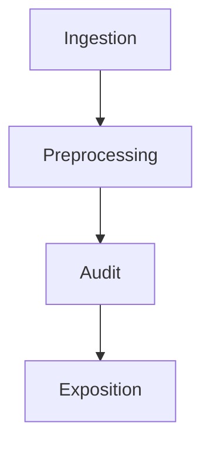
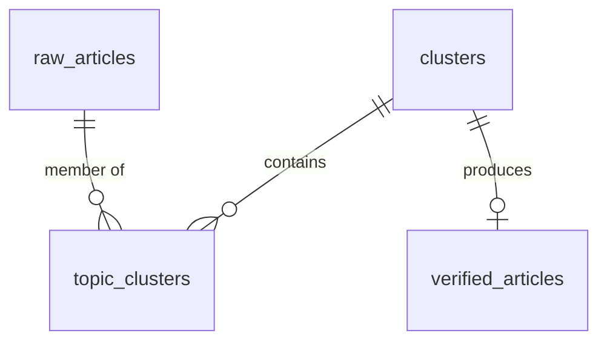
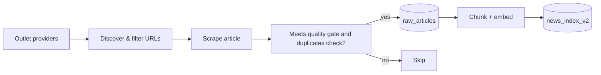
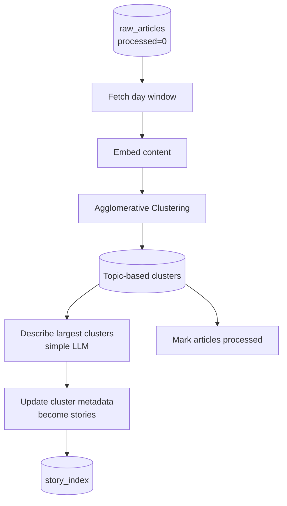
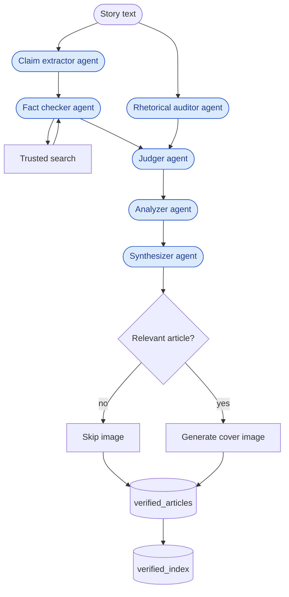
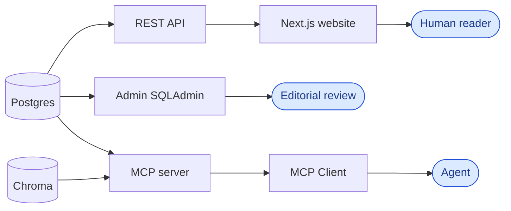

# Architecture

Multi-Source News Verification Pipeline — ingests news from multiple sources, clusters related coverage, runs AI verification and synthesis, and exposes the results through three application surfaces.

Related: [Methodology](methodology.md) 

## System Overview

This is a multi-step pipeline that scrapes text from multiple sources, clusters related topics, runs a set of validation checks, and exposes the results through three application surfaces.

We can break down the pipeline into 4 main stages:

## High-level design principles

The main idea was to create a extensible system that can be flexible to multiple use cases around the same goal: **making the information more reliable and trustworthy.**

To achieve this, we need to follow some design principles:

- I treat long-term data ownership as a core asset, so I avoid putting the system to rely on third-party services that can disappear or change terms overnight. Hence, Postgres holds the persistent data and relationship between the different entities: articles, clusters, and verified output.

- Raw articles still arrive in different shapes from different outlets. Ingestion normalizes them into a shared schema; *clustering* was required to groups same-event coverage into a single story, this is the unit that the rest of the pipeline can audit and publish.

- The surfaces must be decoupled from the core logic to be flexible, we might need to serve the data in different formats or expose it in different ways (as of now, I have a REST API, MCP, and a web app).

- I'm not looking for quantity of articles, I'm looking for quality. The pipeline purpose is to ingest constantly but only cluster and audit the most relevant stories. Plus, I tried to go as low-cost as possible by using open models and cheap services.

## Data model & storage

The data model is simple and straightforward. We have 3 main entities: articles, clusters, and verified output. Plus, three Chroma collections for semantic search.

Postgres owns transactional integrity and admin CRUD; Chroma holds derived vectors for MCP/RAG without denormalizing full text into the search store.

### Postgres tables

Postgres is the source of truth for articles, clusters, and verified output (`common/models.py`, Alembic migrations).

Entity relationships:

### Chroma collections

Chroma holds three derived vector collections for semantic search (`common/indexing.py`).

| Collection | Default name | Unit of index | Document / text | Metadata |
|---|---|---|---|---|
| Raw news chunks | `news_index_v2` | sentence chunks per article (`CHUNK_SIZE=512`, `CHUNK_OVERLAP=64`) | chunk body | `article_id`, `url`, `source`, `title`, `date`, `chunk_index`; node id `{article_id}:{chunk_index}` |
| Story descriptions | `story_index` | one doc per cluster | cluster `description` | `cluster_id`, `created_at`; id = `cluster_id` |
| Verified articles | `verified_index` | one doc per verified article | `{title}\n\n{content}` | `cluster_id`, `title`, `date`, `status`; id = `cluster_id` |

Articles are split with LlamaIndex `SentenceSplitter` into `news_index_v2` so retrieval returns the best matching span per article. 

> Changing embed model or chunk settings invalidates vectors; rebuild with: `python -m common.reindex`

## Pipeline stages

### Ingestion
`python -m ingestion.ingestor`

Fetch articles from configured outlets, normalize into a shared schema, dedupe, then persist to Postgres and chunk-index into Chroma.

For this stage, we need to use [crawl4ai](https://crawl4ai.com/) to discover and scrape articles properly and then we ensure that the article meets a quality gate (length, relevance, etc.) before persisting it to the database.

### Preprocessing
`python -m preprocessing.runner`

Cluster unprocessed time-windowed articles via embedding average-linkage, describe the largest clusters, and index story summaries.

The [Agglomerative Clustering](https://www.geeksforgeeks.org/machine-learning/agglomerative-clustering/) algorithm is a bottom-up approach that starts with each article as a separate cluster and merges clusters that are similar until a distance threshold is reached. Average linkage is the default (less chain-prone than single linkage, less rigid than complete linkage); cosine distance matches the embedding space used elsewhere.

Good to know:
- The selection of the time window is important to avoid clustering articles that are too far apart in time (works well with a *time window of 3 days*).
- The cosine distance threshold of *0.27* is the default since it performed well for our use case; change it to fit your needs.
- Clusters then get LLM descriptions and land in `story_index`.

### Audit
`python -m audit.story_audit`

Run the LangGraph multi-agent verification over eligible unprocessed clusters (stories), then persist a verified article. Rather than one megaprompt, it's a graph of focused agents (`audit/agents`). 

Here’s what each agent does:

1. **Claim extractor** — Pulls atomic, checkable claims from the story cluster and labels each as `reported` (someone said/published X) or `verifiable_fact` (an independently checkable assertion). Does not verify or rewrite.

2. **Rhetorical auditor** — Flags intent, framing, loaded language, omissions, and fallacies (sensationalism, false balance, etc.). Descriptive only.

3. **Fact checker** — Verifies claims against the cluster and trusted search results from official sources. Marks reported claims as `supported-as-reported` when published in sources; marks verifiable facts as `supported` / `contradicted` / `insufficient evidence` with citations.

4. **Judger** — Merges fact-check + rhetoric into three buckets: `absolutely_false`, `not_verifiable`, and `narrative_to_keep` (what a fair rewrite should retain, with attribution).

5. **Analyzer** — Scores editor-facing trust: overall confidence (`high`/`medium`/`low`/`under_review` but in spanish), per-source reliability, claim counts, and rhetoric risk.

6. **Synthesizer** — Rewrites a neutral Spanish news article from `narrative_to_keep` only, dropping false material and avoiding loaded framing.

**Trusted search constraints** (fact checker):
- For reducing cost, we use a short result cache.
- Failures and empty trusted hits yield `insufficient evidence` — never an ungrounded contradiction.

### Exposition

Serve published verified output (and supporting indexes) through three decoupled surfaces. Splitting audiences makes the system more flexible and easier to maintain.

| Surface | Module | Role |
|---|---|---|
| **API** | `api/` | Read-only published verified articles for the website |
| **MCP** | `mcp_app/` | Semantic search and story tools for external AI clients |
| **Admin** | `admin/` | Full SQLAdmin CRUD for editorial operations |
| **Website** | `website/` | Next.js reader UI over the API |

## Scheduler

`deploy/crontab` (`TZ=America/Santo_Domingo` / `PIPELINE_TZ`):

Frequent ingest keeps the raw corpus fresh; preprocess and multi-agent audit are LLM- and search-heavy, so they run on a sparse batch cycle.

Recommended cadence:
- Ingest: Every 3 hours
- Preprocess: Every 3 days at 05:15
- Story audit: Every 3 days at 05:30

