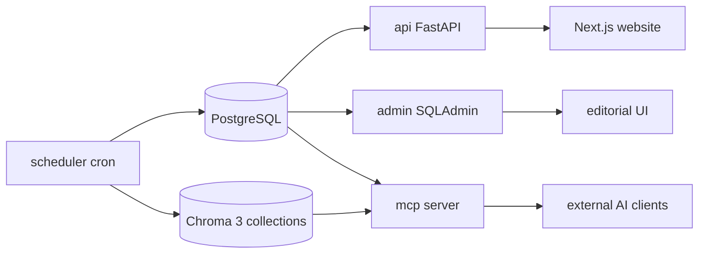

# Architecture

**Ojo Crítico** (technical name: Multi-Source News Verification Pipeline) ingests Dominican news from multiple outlets, clusters related coverage, runs AI verification and synthesis, and exposes the results through three application surfaces.

Related: [Methodology](methodology.md) · [Design decisions](design-decisions.md)

## Data flow

1. **Ingest** (`ingestion/ingestor.py`) — outlet scrapers fetch articles, apply quality gates, deduplicate by URL and `article_key`, and persist to PostgreSQL (`raw_articles`). Each article is chunked and indexed in Chroma collection `news_index_v2`.

2. **Preprocess / cluster** (`preprocessing/runner.py`) — unprocessed articles for the previous local day are embedded, clustered (average-linkage on cosine distance), and written to `topic_clusters` + `clusters`. Top clusters get LLM-generated descriptions; story vectors land in Chroma `story_index`. Articles are marked processed.

3. **Story audit** (`audit/story_audit.py`) — a LangGraph pipeline audits each unprocessed cluster:

   `claim_extractor` → `fact_checker` ↘  
   `rhetorical_auditor` ─────────────→ `judger` → `analyzer` → `synthesizer`

   Results upsert into `verified_articles` and index in Chroma `verified_index`. Optional cover images are generated and stored on disk.

4. **Verified articles** — published rows in `verified_articles` (1:1 with `cluster_id`) are the product output consumed by the API, MCP tools, and admin UI.

## Storage

| Layer | Role |
|---|---|
| **PostgreSQL** | Source of truth: `raw_articles`, `topic_clusters`, `clusters`, `verified_articles` |
| **Chroma** (3 collections) | Semantic search: `news_index_v2` (article chunks), `story_index` (cluster descriptions), `verified_index` (synthesized articles) |
| **Disk** (`/data`) | Chroma persistence, generated article images |

Schema lives in `common/models.py`; data access in `common/db.py`; vector indexing in `common/indexing.py`.

Articles are split with LlamaIndex `SentenceSplitter` (`CHUNK_SIZE=512`, `CHUNK_OVERLAP=64`) into `news_index_v2`. After changing `EMBED_MODEL`, chunk settings, or collection version, run `python -m common.reindex`.

## Application surfaces

| Surface | Path | Audience | Data access |
|---|---|---|---|
| **API** | `api/` | Next.js website (`website/`) | PostgreSQL — published verified articles only |
| **MCP** | `mcp_app/` | External AI clients | Chroma semantic search + PostgreSQL enrichment |
| **Admin** | `admin/` | Editorial staff | PostgreSQL — full CRUD on all tables via SQLAdmin |

All three share `common/config.py` and the same PostgreSQL engine.

### MCP tools

Local stdio: `mcp dev mcp_app/server.py` (or `MCP_TRANSPORT=stdio python -m mcp_app.server`).

| Tool | Purpose |
|---|---|
| `search_articles` | Semantic search over article chunks |
| `search_story` | Semantic search over story descriptions |
| `list_stories` | Browse recent story clusters |
| `get_story` | Full member articles for one cluster |
| `list_verified_articles` | Recent synthesized articles (metadata) |
| `get_verified_article` | Full verified body + sources + confidence |
| `search_verified_articles` | Semantic search over verified title+body |

Resource: `news://verified/{cluster_id}` — one verified article as text.

## Security

When `MCP_TRANSPORT` is `streamable-http` or `sse`, clients must send:

```http
Authorization: Bearer <MCP_API_KEY>
```

Set `MCP_API_KEY` in `.env`. The configured token is shown on the MCP `/` landing page.

## Deploy

Seven services share PostgreSQL and a `pipeline-data` volume:

| Service | Role |
|---------|------|
| **postgres** | PostgreSQL 16 database |
| **migrate** | One-shot Alembic schema migration (runs before app services) |
| **mcp** | Always-on MCP server (streamable HTTP behind Traefik in production) |
| **scheduler** | supercronic jobs from `deploy/crontab` |
| **admin** | SQLAdmin UI (Traefik in production) |
| **api** | Public read API for the website |
| **website** | Next.js site (SSR fetches from **api**) |

### Scheduler

The `scheduler` container runs **supercronic** on `deploy/crontab` (`TZ=America/Santo_Domingo`):

| Schedule | Job |
|---|---|
| Every 3 hours | `python -m ingestion.ingestor` |
| Every 3 days 05:15 | `python -m preprocessing.runner` |
| Every 3 days 05:30 | `python -m audit.story_audit` |

Ingest skips known URLs and duplicate `article_key` fingerprints (calendar day + source + normalized title).

### Local development

```bash
cp .env.example .env
docker compose -f docker-compose.yml -f docker-compose.local.yml up -d --build
```

Ports: MCP `7000`, admin `7001`, API `7002`, website `7003`, Postgres `5432`. No Traefik or external `proxy` network required.

### Production (VPS + Traefik)

Prerequisites: Docker Compose, Traefik on the external `proxy` network.

```bash
docker network create proxy   # once, if missing
cp .env.example .env
# set MCP_DOMAIN, MCP_API_KEY, ADMIN_DOMAIN, ADMIN_USERNAME, ADMIN_PASSWORD, ADMIN_SECRET_KEY
# set API_DOMAIN, API_KEY, WEBSITE_DOMAIN, WEBSITE_URL, WEBSITE_API_KEY
# set DEEPINFRA_API_KEY, DEEPSEEK_API_KEY, FACT_CHECK_SEARCH_API_KEY (or SERPER_API_KEY)

docker compose up -d --build
```

- MCP: `http://${MCP_DOMAIN}/mcp` — Bearer `MCP_API_KEY`
- Admin: `http://${ADMIN_DOMAIN}/admin`
- API / website: `http://${API_DOMAIN}` and `http://${WEBSITE_DOMAIN}`
- Manual jobs: `docker compose run --rm scheduler python -m ingestion.ingestor` (or `preprocessing.runner`, `audit.story_audit`)

First **ojo-critico** image build is heavy (Playwright Chromium + embedding model); admin/api/website images are slimmer.

## System diagram


